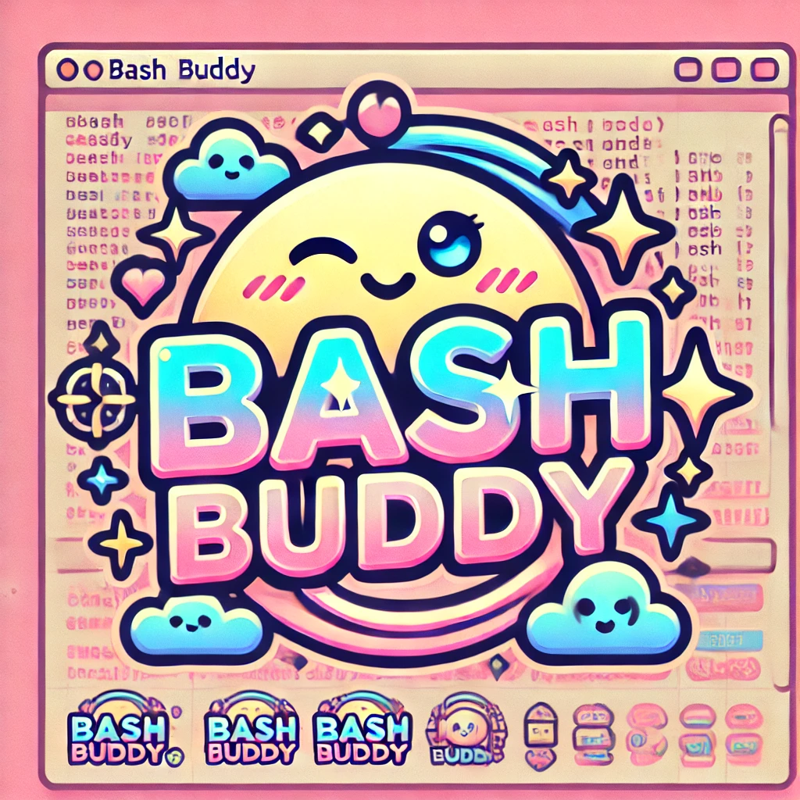

# Bash Buddy 🐟💬  

*A Gen Z AI chat tool for your terminal, combining wit, vibes, and functionality.*  



---

## 🌟 Overview  

Bash Buddy is your friendly, terminal-based AI chat companion designed to make your CLI sessions fun and engaging. Whether you’re solving coding problems, getting life advice, or just need a virtual buddy to chat with, Bash Buddy is here to slay.  

With a mix of humor, smarts, and Gen Z energy, Bash Buddy will feel like the terminal BFF you never knew you needed.  

---

## 🚀 Features  

- **Sassy & Smart Conversations**: Bash Buddy doesn’t just chat—it vibes.  
- **Always On Your Side**: Whether you’re debugging or philosophizing, Bash Buddy’s got your back.  
- **No Downloads Required**: Accessible directly via SSH for ultimate convenience.  

---

## 📦 Installation  

1. Connect via SSH for remote access:  

   ```bash
   ssh bashbuddy.kyou.tech
   ```  

---

## 🛠️ Contributing  

We welcome contributions! To get started:  

1. Fork this repo.  
2. Create a feature branch:  

   ```bash
   git checkout -b my-new-feature
   ```  

3. Commit your changes:  

   ```bash
   git commit -m "Add some feature"
   ```  

4. Push to the branch:  

   ```bash
   git push origin my-new-feature
   ```  

5. Open a pull request.  

---

## 🎉 Community  

Join the Bash Buddy community to share ideas, memes, and updates:  

- 💬 [Discord](https://discord.gg/bashbuddy)  
- 🐦 [Twitter](https://twitter.com/bashbuddy)  
- 📸 [Instagram](https://instagram.com/bashbuddy)  

---

## 📜 License  

This project is licensed under the [MIT License](LICENSE).  

---

Ready to bring some color and humor to your terminal? Give **Bash Buddy** a try today!  
